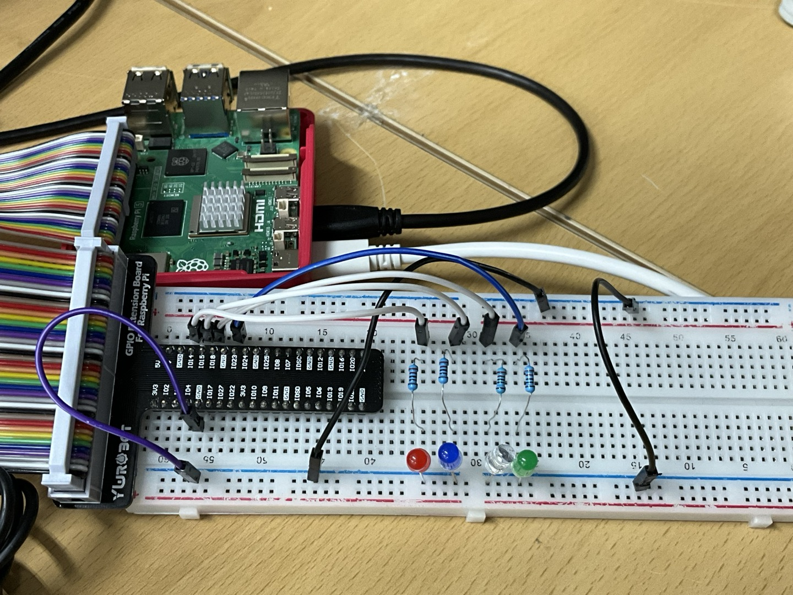

# Binary Counter with LED

## 📝 프로젝트 개요

이 프로젝트는 Raspberry Pi 5와 GPIO 핀을 활용하여 3개의 LED로 0부터 7까지 이진수로 표현하는 카운터 시스템을 구현하는 것이다. Bash 스크립트를 통해 핀을 제어하며, `pinctrl` 명령어를 사용해 각 핀의 출력 상태를 조작한다. LED는 1초 간격으로 이진수에 따라 점등되며, 회로는 브레드보드 상에서 구성되었다.

---

## 💡 counter8 스크립트 설명

```bash
#!/usr/bin/bash  # Bash 셸에서 실행되는 스크립트임을 명시

LEDS=(14 15 18) # 제어할 LED 핀 번호들을 배열로 저장

# 모든 핀을 출력 모드(op)로 설정하고, 초기값을 low(dl)로 설정
for PIN in "${LEDS[@]}"; do
	pinctrl set $PIN op # 핀을 출력 모드로 설정
	pinctrl set $PIN dl # 핀의 출력값을 low(0)로 설정하여 LED를 끔
done

# 무한 반복 루프
while true; do
    for count in {0..7};  # count를 0부터 7까지 반복 (3비트로 표현 가능한 범위)
        for i in {0..2}; do
            # i = 0 ➜ 4의 자리 (count/4)%2
            # i = 1 ➜ 2의 자리 (count/2)%2
            # i = 2 ➜ 1의 자리 (count/1)%2
            if (( (count / (2 ** (2 - i))) % 2 )); then 
                pinctrl set ${LEDS[i]} dh # 해당 자리수가 1이면 해당 핀을 high(1)로 설정 → LED 켬
            else
                pinctrl set ${LEDS[i]} dl  # 해당 자리수가 0이면 해당 핀을 low(0)로 설정 → LED 끔
            fi
        done
        sleep 1 # 1초 대기 후 다음 숫자로 진행
    done
done
```
---
## 🧩 핀맵 : LED와 GPOI 연결

| LED 색상 | 연결된 GPIO 핀 |
|----------|----------------|
| 빨강     | GPIO 14        |
| 파랑     | GPIO 15        |
| 하양     | GPIO 18        |
| 초록     | GPIO 23        |

#### 3bit counter로, 초록LED는 사용하지 않았습니다.
---
## 🔌 회로 구성 설명


- 브레드보드의 - 라인에 Raspberry Pi의 GND 연결
- LED 연결 순서
  1. Raspberry Pi GPIO ➝ 점퍼선 ➝ 저항 
  2. 저항 ➝ LED의 긴 다리 (애노드, +)
  3. LED의 짧은 다리 (캐소드, -) ➝ 브레드보드의 GND(-) 라인

---
## 🔄 Raspberry Pi와의 통신 구조
1. Bash 스크립트는 GPIO 설정 및 제어 명령을 실행합니다.
2. pinctrl 명령어를 사용하여 GPIO 핀을 직접 제어합니다.
3. WSL 또는 SSH 환경에서 스크립트를 실행할 수 있으며, .sh 파일에 실행 권한을 부여한 후 실행합니다
- op: Output 모드 설정
- dh: Digital High (3.3V)
- dl: Digital Low (0V)

실행 방법
```bash
chmod +x counter8
./counter8
```
---
## 📎 기타 정보
사용 보드: Raspberry Pi 5

사용 언어: Bash

실행 조건: pinctrl 명령어가 /usr/bin/pinctrl에 설치되어 있어야 함
