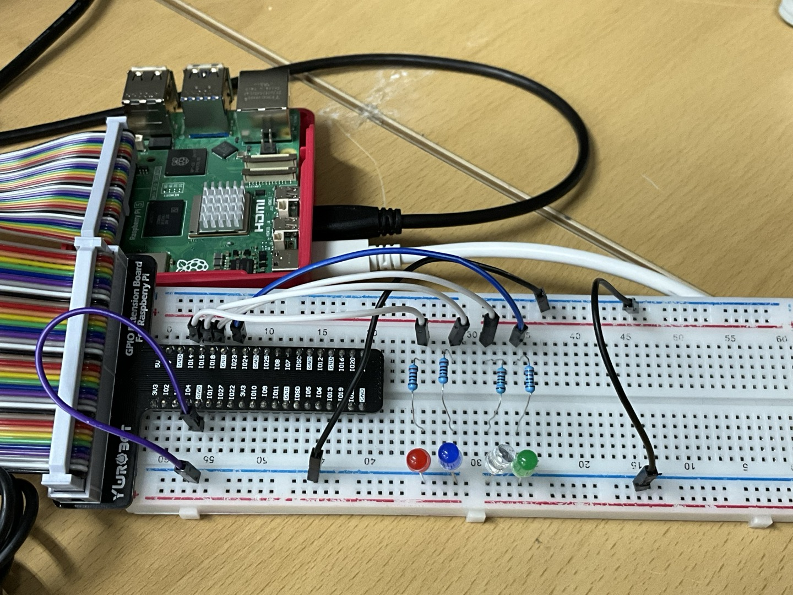

# 도미노 LED 시퀀스 제어

## 📝 프로젝트 개요
이 프로젝트는 Raspberry Pi의 GPIO 핀을 이용하여 4개의 LED를 도미노처럼 순차적으로 점등시키는 간단한 시퀀스 제어 시스템입니다. Bash 스크립트를 통해 핀을 제어하며, `pinctrl` 유틸리티를 사용하여 GPIO의 출력을 설정합니다.

---

## 💡 domino4 스크립트 설명

```bash
#!/usr/bin/bash  # Bash 셸에서 실행되는 스크립트임을 명시

LEDS=(14 15 18 23)  # 제어할 LED 핀 번호들을 배열로 저장

# 모든 핀을 출력 모드(op)로 설정하고, 초기값을 low(dl)로 설정
for PIN in "${LEDS[@]}"; do
	pinctrl set $PIN op  # 핀을 출력 모드로 설정
	pinctrl set $PIN dl  # 핀의 출력값을 low(0)로 설정하여 LED를 끔
done

# 무한 반복 루프
while true; do
	for PIN in "${LEDS[@]}"; do
		pinctrl set $PIN dh  # 해당 핀의 출력을 high(1)로 설정 → LED 켜짐
		sleep 1              # 1초 대기
		pinctrl set $PIN dl  # 해당 핀의 출력을 다시 low(0)로 설정 → LED 꺼짐
	done
done
```
🔍 코드 흐름 요약
1. GPIO 핀 초기화: 14, 15, 18, 23번 핀을 출력 모드(op)로 설정하고 LOW(dl)로 초기화합니다.
2. LED 순차 점등: 4개의 핀을 차례로 HIGH(dh)로 설정하여 1초씩 점등한 뒤 다시 LOW(dl)로 꺼줍니다.
3. 무한 반복: 위 점등 과정을 while true 루프를 통해 반복합니다.

---

## 🧩 핀맵 : LED와 GPOI 연결

| LED 색상 | 연결된 GPIO 핀 | 연결순서
|----------|----------------|---------
| 빨강     | GPIO 14        | 1번째 점등
| 파랑     | GPIO 15        | 2번째 점등
| 하양     | GPIO 18        | 3번째 점등
| 초록     | GPIO 23        | 4번째 점등

---
## 🔌 회로 구성 설명


- 브레드보드의 - 라인에 Raspberry Pi의 GND 연결
- LED 연결 순서
  1. Raspberry Pi GPIO ➝ 점퍼선 ➝ 저항 
  2. 저항 ➝ LED의 긴 다리 (애노드, +)
  3. LED의 짧은 다리 (캐소드, -) ➝ 브레드보드의 GND(-) 라인

---
## 🔄 Raspberry Pi와의 통신 구조
1. Bash 스크립트는 GPIO 설정 및 제어 명령을 실행합니다.
2. pinctrl 명령어를 사용하여 GPIO 핀을 직접 제어합니다.
3. WSL 또는 SSH 환경에서 스크립트를 실행할 수 있으며, .sh 파일에 실행 권한을 부여한 후 실행합니다
- op: Output 모드 설정
- dh: Digital High (3.3V)
- dl: Digital Low (0V)

실행방법
```bash
chmod +x domino4.sh
./domino4.sh
```

---
## 📎 기타 정보
사용 보드: Raspberry Pi 5

사용 언어: Bash

실행 조건: pinctrl 명령어가 /usr/bin/pinctrl에 설치되어 있어야 함
