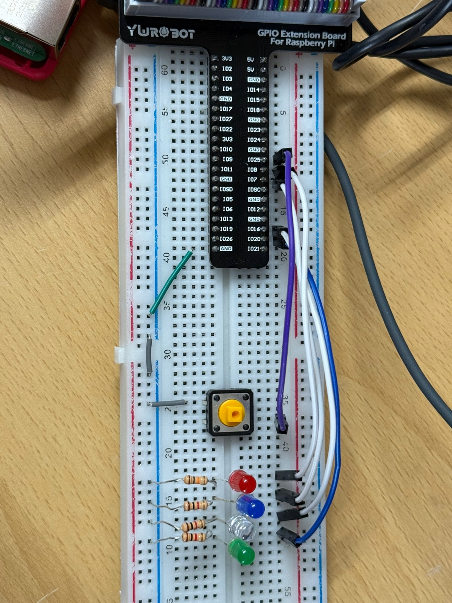

# 🎯 버튼 스위치 활용하기

Raspberry Pi와 Python(`gpiozero` 라이브러리)를 활용하여 버튼 스위치 입력에 따라 다양한 LED 동작을 제어하는 실습입니다.


---
## ✅ 회로 구성

- 버튼: GPIO 25번 핀에 연결 (풀업 설정)
- LED: GPIO 8, 7, 16, 20번에 연결
- 저항(R)을 이용한 풀업 회로 구성

---

## 1️⃣ 미션 1 - 버튼이 눌린 동안만 LED 켜기

```python
from gpiozero import LED, Button
from signal import pause

led = LED(8)
button = Button(25, pull_up=True)

def led_on():
    led.on()

def led_off():
    led.off()

button.when_pressed = led_on
button.when_released = led_off


try:
    pause()
except KeyboardInterrupt:
    print("\n프로그램을 종료합니다 :)")
```

## 📝 개발 환경
Raspberry Pi 5

Python

gpiozero 라이브러리

라즈베리파이 GPIO 핀 연결


## 🔧 참고사항
각 미션마다 pull_up=True 설정을 통해 풀업 저항 회로를 구현했습니다.

버튼 중복 입력 방지를 위해 sleep()을 이용한 디바운싱 처리 포함.


## 시연영상
https://youtube.com/shorts/yQNIPoFAYyc?si=VLLuT1tkBBzqeqWI
